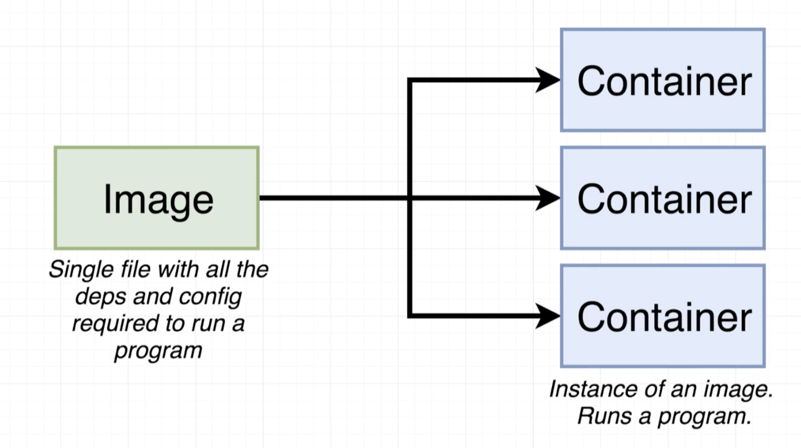
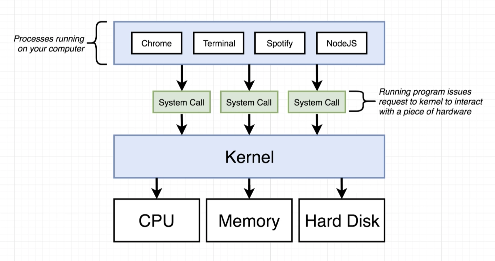
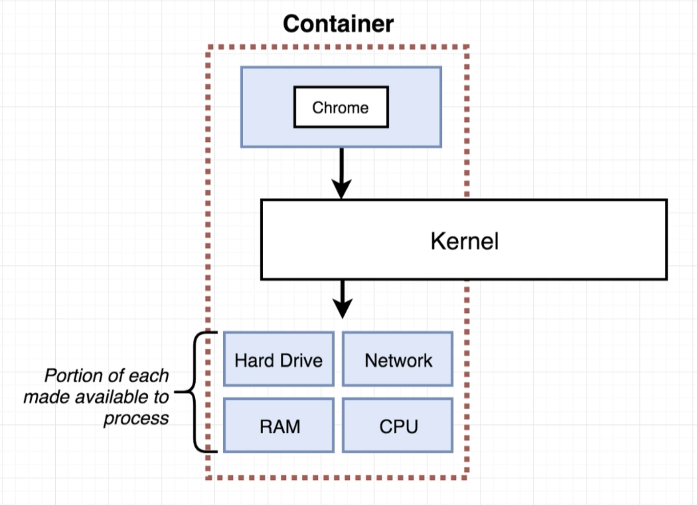
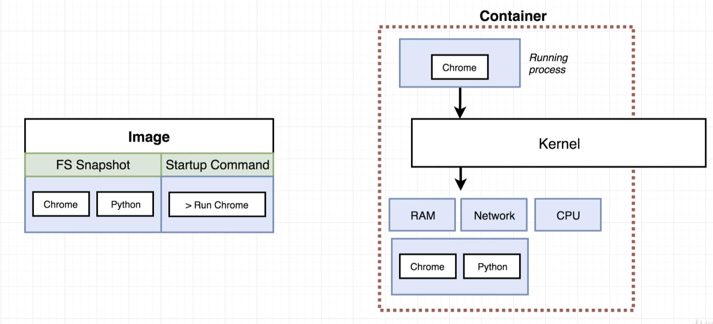
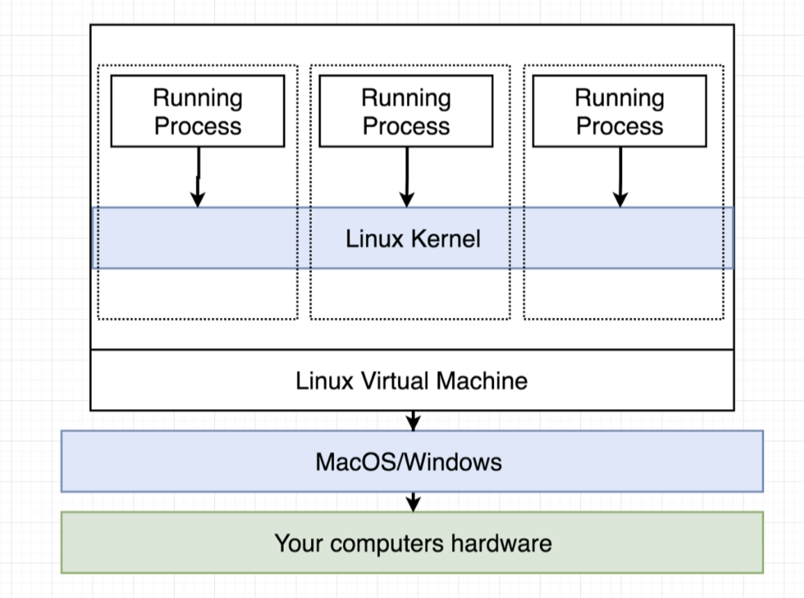
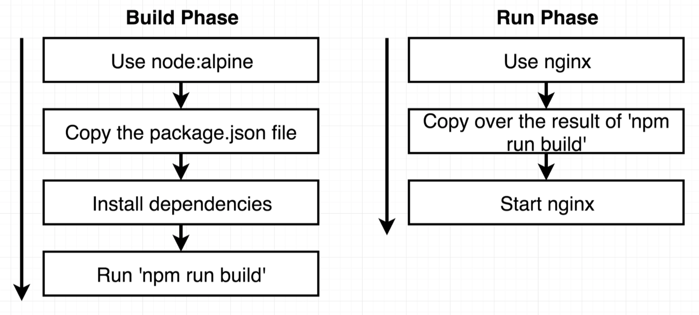
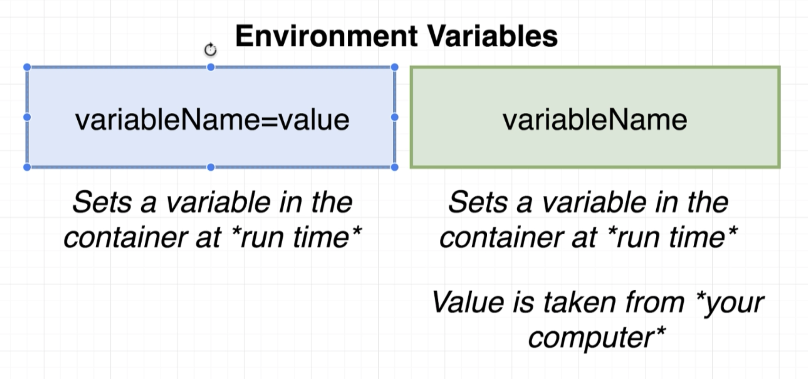

# Docker notes

Most of these notes are taken from the first part of Udemy's [Docker and Kubernetes: The Complete Guide](https://www.udemy.com/course/docker-and-kubernetes-the-complete-guide/) course.

## What is Docker
<details>
<summary>Click to expand</summary>

- Docker is a system for simplifying software dependency installation.
- Docker is a platform or ecosystem for creating and running containers.
- A container is a program with its own isolated set of hardware resources, and it is built from an image file that specifies its environments and dependencies.

  

- `docker run hello-world` - this introductory command creates container from the `hello-world` image and runs it.
```
Hello from Docker!
This message shows that your installation appears to be working correctly.

To generate this message, Docker took the following steps:
 1. The Docker client contacted the Docker daemon.
 2. The Docker daemon pulled the "hello-world" image from the Docker Hub.
    (amd64)
 3. The Docker daemon created a new container from that image which runs the
    executable that produces the output you are currently reading.
 4. The Docker daemon streamed that output to the Docker client, which sent it
    to your terminal.
```
</details>

## Image and container basics
<details>
<summary>Click to expand</summary>
- Basic diagram of an operating system:

  

- A container basically allocates a certain amount of hardware resources to run exclusively for that container:

  

- This container can be given a template and start command from an image:

  

- The OS use namespacing to enable different areas of hardware resources to be used exclusively by different processes, and control groups to limit the amount of resources these container can consume. However, namespacing and control groups are only available on Linux.
- To handle this, the Docker server running locally on MacOS/Windows runs a Linux virtual machine, and the containers are run inside that virtual machine.

  
</details>

## Docker CLI
<details>
<summary>Click to expand</summary>

### Running a container
Run a container with the simple `run` command:
```
$ docker run <image-name>
```
You can override the default image command using
```
$ docker run <image-name> <command>
```

### Currently running containers
Can see the currently running containers with the `ps` command:
```
$ docker ps
```
To see all containers that have ever run can use the `--all` flag:
```
$ docker ps --all
```

### Container lifecycle
- `docker run <image-name>` is actually a combination of `docker create <image-name>` and `docker start <container-id>`.
- Creating a container really just sets up the filesystem in the container from the image template to be used.
- Starting the container executes the startup command. Adding a `-a` (attach) option to the command is what makes Docker print the container's output to your terminal.
- When a container is exited it can be started again.
- Once a container is started the default command cannot be overridden a second time. So, if you re-run an existed container with `docker start` you cannot provider a different start command.
- Stopped containers just sit there and take up disc space, so they need to be cleaned up.
- To clean up exited containers you can use `docker system prune`, however this will also delete all of the cached images, which would then need to be downloaded from the Docker registry again.

### Getting logs from a container
Can use `docker logs <container-id>` to get the output logs of a container to your terminal.

### Stopping a container
Can use either `docker stop <container-id>` or `docker kill <container-id>`. Stop uses a `SIGTERM` command to the running process inside the container, which allows the process time to clean up on shut down. The kill command will use `SIGKILL` which means shut down right now, and may not clean up.

### Executing commands inside a running container
Can use the `execute` command to run an additional command inside a container:
```
$ docker exec -it <container-id> <command>
```
Here the `-it` argument allows us to type input into the conainer. The `-i` attaches our terminal to the container process's STDIN and STDOUT channels, and the `-t` flag makes the text formatting pretty - like prompts, autocomplete, etc.

Can use the `exec` command to get shell access to a container using `sh` as the command to run
```
$ docker exec -it <container-id> sh
```
You can also use `sh` as an override command to just start a container with a shell to poke around in its environment
```
$ docker run -it <image-name> sh
```
</details>

## Creating Docker images
<details>
<summary>Click to expand</summary>
Create a `Dockerfile` with configuration of how the container should behave. This Dockerfile then gets used by the Docker client and Docker server to create a container. To create a Dockerfile you generally:
1. Specify a base image
2. Run commands to install additional programs
3. Specify a startup command

### Example creating a Docker image to run redis-server
In your `Dockerfile` you specify instructions that tell the Docker server what to do, with arguments. Here is a basic example:
1. Make a file called `Dockerfile` in the directory you want to create your image.
2. In the Dockerfile write
    ```Dockerfile
    FROM alpine
    RUN apk add --update redis
    CMD ["redis-server"]
    ```
3. Run `docker build .` from the directory with your `Dockerfile`.
4. Run `docker run <image-id>` where the `image-id` is output from the build command.

The commands used in this Dockerfile are:
- The `FROM` instruction is used to tell Docker which image to use as a base. This base image is basically an initial operating system or starting point for the image we are creating. Here `alpine` was used because it includes a good default set of programs for what we needed to accomplish. For example, `apline` comes with the `apk` package manager that let us run the next instruction to install `redis-server`.
- The `RUN` instruction is used to specify some command to run while we are preparing the custom image.
- The `CMD` instruction is used to specify which command should be run when our image is used to start a new container.

When Docker server runs this Dockerfile the following happens:
1. A base image is fetched for step 1.
2. The `RUN` instruction creates a temporary image from the output of the previous step, and uses `apk add --update redis` as that temporary image's start up command.
3. This temporary image is then used to create a container and runs.
4. This container is then stopped, has its file system snapshot taken as a new temporary image.
5. The `CMD` instruction then uses the previous step's output temporary image and adds the specified command `redis-server` as the image's start up command.
6. This temporary image is then used as a snapshot for this step's output image (which is the full process's output image), and its temporary image is deleted.

So basically, each steps takes the output intermediate image from the previous step, creates a container with it and adds a start up command to run, runs the command, and takes a snapshot as the output image for the next step. The image output from the last step is the image created for the whole process.

Note that the intermediate images will get cached in your local cache, so adding a second `RUN` command (for example) will use cached images for the `FROM` and first `RUN` command, which makes building the updated image faster.

### Tagging an image
You can tag an image so you do not need to remember the id the build command outputs. The format is
```
docker build -t <tag> .
```
The tag format is generally of the form
```
<docker user id> / <repo/project name> : <version>
```
So an example would be
```
benblake/redis:latest
```

### Getting files in the container to be executed
When you run a container only the files specified in that container's image are present. You need some way to get your project files into the container to be executed.

You can do this by using the `COPY` command:
```
COPY ./ ./
```
This will copy files from the build context directory to the temporary docker containers through its run process.

### Port mapping
When you have a web server running in your container it is exposed on one of the container's ports, and by default this does not expose it to your machine's ports - so you cannot go to the browser to see you web app running. To acheive this you need to map your machine's port to point to the container's port.

Port forwarding is _not_ setup in the Dockerfile - it is setup in the docker run command using the `-p` option. The localhost and container ports do not need to be the same.
```
docker run -p <localhost port>:<container port> <image-id>
```

### Specifying a working directory
By default the `COPY ./ ./` will copy all your local context's files directly into the root of the container. Specifying the `WORKDIR` instruction in the Dockerfile (before the `COPY` command) will use the specified directory for copying files _and_ running all subsequent commands in the container.

All the above steps together produce a Dockerfile for a simple node app as follows
```Dockerfile
FROM node:alpine
WORKDIR /usr/app
COPY ./ ./

RUN npm install

CMD ["npm", "start"]
```
</details>

## Docker compose
<details>
<summary>Click to expand</summary>
Docker compose is a separate CLI tool that gets installed with Docker. It is used to start up multiple Docker containers at one time, and gets rid of some of the long-winded config options needed for the `docker run` command.

To use Docker compose you create a `docker-compose.yml` file that specifies what configurations you want for each container: ie. its image, port mappings, etc. This file will get passed to the Docker compose CLI which will parse it and be responsible for running all the Docker commands we need. A simple Docker compose file example could be
```yml
version: '3'
services:
  redis-server:
    image: 'redis'
  node-app:
    build: .
    ports:
      - "4001:8081"
```
This specifies two services to be run: `redis-server` and `node-app`. It specifies the image for the Redis service, and for the Node service specifies the current directory to build the container using the Dockerfile present, and specifies the port mappings so the app is accessible on localhost.

Note that Docker compose will run these containers so that they have access to each other - you do not need to set up any other networking infrastructure. We could connect to the Redis instance running on the `redis-server` from the node app container simply by using `redis-server` as the host to connect to.

### Docker compose CLI
The Docker compose command for running an image (similar to `docker run <image>`) is
```
$ docker-compose up
```
We do not need to specify an image because Docker compose will look in our current directory for a `docker-compose.yml` to run.

If we want to rebuild the image before running we can use
```
$ docker-compose up --build
```

Note we get `Docker Compose is now in the Docker CLI, try 'docker compose up'` - so looks like we could use that instead.

We can run the containers in the background with
```
$ docker-compose up -d
```
and then stop the containers with
```
$ docker-compose down
```

You can use `docker-compose ps` from your project directory and see status of the associated Docker conainters, which gives a pretty nice output.
```
        Name                       Command               State           Ports
---------------------------------------------------------------------------------------
visits_node-app_1       docker-entrypoint.sh npm start   Up      0.0.0.0:4001->8081/tcp
visits_redis-server_1   docker-entrypoint.sh redis ...   Up      6379/tcp
```
</details>

## Some development concerns
<details>
<summary>Click to expand</summary>

### Dockerfile name
You may want to run separate commands in dev versus prod for your web server, for example `npm run start` in dev versus `npm run build` in prod for a React app. This will cause you to want to use two separare dockerfiles in your app. You can use a name like `Dockerfile.dev` and then point the docker build command to this file instead of using the default `Dockerfile`
```
$ docker build -f Dockerfile.dev .
```

### Updating source files
As it stands one of the step in creating the Docker image is copying over the source files to the `WORKDIR`. This means that right now any time we change a source file in dev, to see the changes we need to rebuild a new image, and run a new container. This is really not sustainable.

Instead of copying the source files into the image build process we will use Docker _volumes_, which basically creates a reference inside the Docker image to the local copies of our source files, so the container will automatically see all the source files's updates as we develop the app. The docker run command option to specify a version to map your current working directory into the `/app` direcory in the container is
```
-v $(pwd):/app
```
You can also put a bookmark on a folder/file in the container to _not_ map it to a corresponding directory using the same option without the `:` as
```
-v /app/node_modules
```

This makes for a long docker run command, so we can use docker compose to clean this up. The above within a `docker-compose.yml` is
```yml
version: '3'
services:
  web:
    build:
      context: .
      dockerfile: Dockerfile.dev
    ports:
      - "3000:3000"
    volumes:
      - /app/node_modules
      - .:/app
```
</details>

## Some production concerns
When we run `npm run start` this spins up a _development_ web server to connect to through localhost. When we run `npm run build` that will basically just compile a production appropriate set of assets that need to be served up by a _production_ web server - this is not included. Here we will use Nginx as our production web server.

We will create a separate Dockerfile to create a production version of our web container. There are two weird issues with creating a straight forward Dockerfile for prodution
1. Once we run `npm run build` the dependencies in `node_modules` are no longer needed - we do not need to be carrying those around in our container, we only need the build directory.
2. If we use `node:alpine` as the base image where do we get Nginx from?

This will be solved by using a multi-step Docker build:



The Dockerfile for the multi-step build is
```Dockerfile
FROM node:16-alpine as builder
WORKDIR '/app'
COPY package.json .
RUN npm install
COPY . .
RUN npm run build

FROM nginx
COPY --from=builder /app/build /usr/share/nginx/html
```

Note there is no `CMD` instruction on the nginx block - this is because there is a default command in the nginx image that will be used.

## Environment variables
Environment variables are common for secrets, for example db connection passwords. Environment variables can be set in your `docker-compose.yml` file. They can either be explicitly set, or defined and have their value pulled from your machine's environment variable. Note they are available in the container at _run time_ - the image building process does not get access to the environment variables.



In a docker-compose file with Postgres, Redis, and a server services this looks like
```yml
version: '3'
services:
  postgres:
    image: 'postgres:latest'
    environment:
      - POSTGRES_PASSWORD=postgres_password
  redis:
    image: 'redis:latest'
  server:
    build:
      dockerfile: Dockerfile.dev
      context: ./server
    volumes:
      - /app/node_modules
      - ./server:/app
    environment:
      - REDIS_HOST=redis
      - REDIS_PORT=6379
      - PGUSER=postgres
      - PGHOST=postgres
      - PGDATABASE=postgres
      - PGPASSWORD=postgres_password
      - PGPORT=5432
```

## Examples
Some example apps are in this repo to be used for reference.

### Simple Node/Redis webapp
The [visits](./visits) app contains an example of a simple Docker compose project. It is a Node webapp that tracks visits and stores the count in Redis. It is two containers with very simple configurations.

## Common commands

### Docker
- `$ docker run <image-name>`
  - Runs a container. Combination of the `docker create <image-name>` and `docker start <container-id>` commands.
  - `-p` option to specify port mapping, like `-p 3000:3000`
  - `-v` to specify volumes
    - `-v /app/node_modules` to specify bookmarks (container directories that should not be volumed).
    - `-v $(pwd):/app` to specify volumes.
- `$ docker run <image-name> <command>`
  - Runs a container overriding the default command.
- `$ docker build .`
  - Builds an image based on the Dockerfile in the current directory.
  - Can also take a file option with `-f` to specify the Dockerfile's name.
- `$ docker ps`
  - See all the currently running containers.
- `$ docker ps --all`
  - See all containers that have ever run.
- `$ docker system prune`
  - Deletes stopped containers and the docker image cache to clear up space.
- `$ docker logs <container-id>`
  - Tail the logs from the running container.
- `$ docker stop <container-id>` and `$ docker kill <container-id>`
  - Stop or kill a container by issuing the SIGTERM or SIGKILL commands, respectively.
- `$ docker exec -it <container-id> <command>`
  - Issue a new command to a running container. `-i` attaches to the containers STDIN/STDOU, and `-t` makes the test formatting nice.

### Docker compose
- `$ docker-compose up`
  - Runs the containers defined in the `docker-compose.yml` file.
- `$ docker-compose up --build`
  - Rebuilds the images before running the containers.
- `$ docker-compose up -d`
  - Runs the containers in the background.
- `$ docker-compose ps`
  - Shows all running containers in the pwd.
- `$ docker-compose down`
  - Stops the containers.

## Common Dockerfile configs

### Docker
- `FROM`: used to tell Docker which image to use as a base.
- `RUN`: specifies a command to run while we are preparing the custom image.
- `CMD`: specifies the start command for the image.
- `COPY`: copies files from the project directory into the container. `COPY <machine dir> <container dir>`.
- `WORKDIR`: specifies the working directory in the container. This is where files will be copied (if `COPY` is after it in the Dockerfile) and commands will be executed.

### Docker compose
- `version`: specifies the Docker compose version, using '3' for everything so far
- `services`: the list of services you want to run (container specifications).
- `image`: the image to use for a service.
- `build`: what `Dockerfile` and context to use for a service (instead of using the `image` option).
  ```yml
  # specify a context and dockerfile
  build:
    context: .
    dockerfile: Dockerfile.dev

  # specify context with a default Dockerfile
  build: .
  ```
- `ports`: list of port mappings for the service.
  ```yml
  ports:
    - "3000:3000"
  ```
- `volumes`: list of the volumes to setup.
  ```yml
  volumes:
    - /app/node_modules
    - .:/app
  ```
- `command`: override the startup command using the same syntax, eg.
  ```yml
  command: ["npm", "run", "start"]`
  ```
- `restart`: restart policy to use when the service crashes. Options are `"no"`, `always`, `on-failure`, or `unless-stopped`.