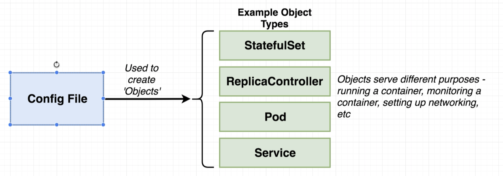

# Kubernetes notes

Most of these notes are taken from the first part of Udemy's [Docker and Kubernetes: The Complete Guide](https://www.udemy.com/course/docker-and-kubernetes-the-complete-guide/) course.

## What is Kubernetes
Kubernetes allows us to indiviually scale the necessary containers as we need. A k8s cluster consists of 
1. A Master which controls which each Node does.
2. Nodes, which can run more than 1 container of different or same image. These nodes are virtual or physical machines.

You interact with the k8s cluster by issuing commands to the Master, which in turn controls the containers running in the nodes.

In development we use Minikube to setup a small k8s cluster on your local computer. In production we would use a managed solution like Amazon Elastic Container Service for Kubernetes (EKS) or Google Cloud Kubernetes Engine (GKE).

### Some differences between Docker and k8s
- K8s expects all images to be built - we cannot specify _how_ to build an image like we did in our `docker-compose.yml` files.
- K8s requires 1 config file per object, cannot have a global config file like `docker-compose.yml`.
- K8s requires us to set up all our networking manually.


## Some `kubectl` commands
- `$ kubectl cluster-info` to see status of the k8s cluster

## Setting up basic k8s config files
We will start by building the multi-container web pod from the previous Docker example. Start with the `client-pod.yml` and `client-node-port.yml` config files as below:
```yaml
# client-pod.yml
apiVersion: v1
kind: Pod
metadata:
  name: client-pod
  labels:
    component: web
spec:
  containers:
    - name: client
      image: stephengrider/multi-client
      ports:
        - containerPort: 3000
```

```yaml
# client-node-port.yml
apiVersion: v1
kind: Service
metadata:
  name: client-node-port
spec:
  type: NodePort
  ports:
    - ports: 3050
      targetPort: 3000
      nodePort: 31515
  selector:
    component: web
```
Here we have created two config files we will feed into the `kubectl` command. `kubectl` will interpret these files and create two "objects".


An "object" is really just a thing inside a k8s cluster. The type of object you want to make is defined by the `kind` attribute in the config file. The `apiversion` attribute defines the types of objects we can use.

- A pod is used to run a container.
- A service is used to setup some kind of networking within the k8s cluster.

#### The Pod type of k8s object
A Pod is a grouping of containers with a common purpose running inside the k8s Node. In k8s we do not have the ability torun a "naked" container - the smallest thing we can run is a Pod. Requirement of a Pod is that we must run 1 or more containers inside it. The purpose of a Pod is to run containers with a _very_ similar purpose.


image: stephengrider/multi-client
