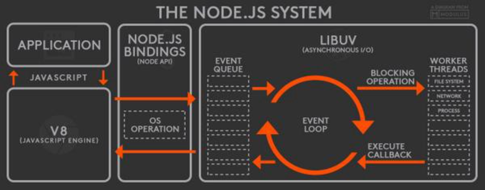

# Node Notes

Most of these notes are taken from Udemy's [Complete NodeJS Developer in 2022](https://www.udemy.com/course/complete-nodejs-developer-zero-to-mastery) course.

##  Basics
- Node uses the V8 Engine for JavaScript.
- Uses libuv library for asynchronous I/O - connecting to filesystem, databases, etc.
- ZTM NodeJS [cheatsheet](https://zerotomastery.io/cheatsheets/node-js-cheat-sheet/?utm_source=udemy&utm_medium=coursecontent).
- [This article](https://medium.com/jspoint/how-javascript-works-in-browser-and-node-ab7d0d09ac2f) looks pretty good.
- jsonplaceholder is a good site to test realistic json responses.

## JavaScript runtime
JS is single threaded - it operates a single callstack. A JS runtime provides two things:
1. A JS engine to interpret the code. This engine contains the callstack that runs the interpreted code.
2. A set of asynchronous APIs to be used to allow the runtime to operate in an asynchronous manner. In node this is the libuv library.

When one of the APIs is called the engine no longer worries about it - and the asynchronous APIs handle execution on a worker process. Once the execution is completed the result is added to the callback queue. Then, there is an event loop that will pop operations of the callback queue to be executed by the JS engine when its callstack is empty. A good diagram of this architecture is below

## Promises
Promises are objects that may produce a single value sometime in the future - a resolved value or a reason it is not resolved (rejected). A promise can be in one of three states: fulfilled, pending, or rejected.